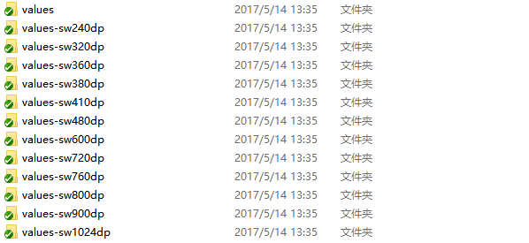
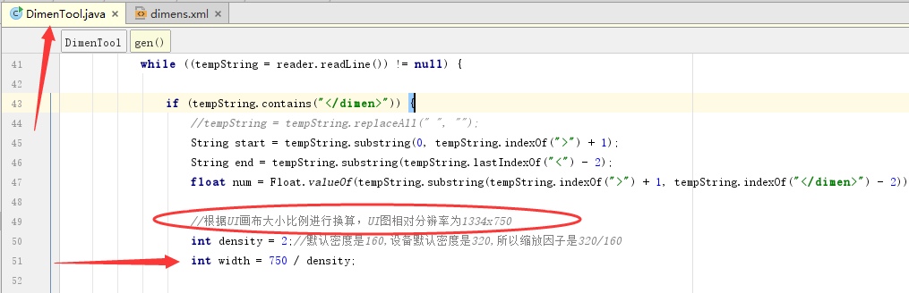
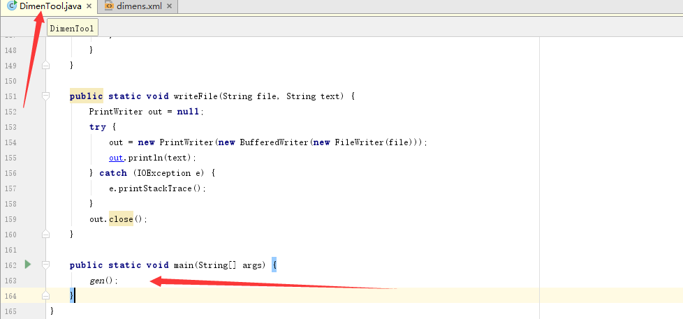
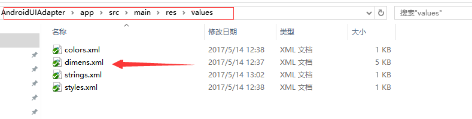

# AndroidUIAdapter
安卓屏幕适配方案，只需一个步骤即可使用，也可根据自己项目设计图画布大小和像素尺寸实时精准适配，适配所有市面上各种大小不一的安卓手机屏幕，特点是可以直接在Android studio的XML编辑器中直接预览不同手机屏幕的适配效果，提高工作效率，且完全不会有性能问题，极易上手

### 使用

1. **第一步，复制该项目res目录下包含dimens.xml的velues文件夹到自己的项目的res目录下，其中values文件夹只复制其dimens.xml文件**

   

2. **直接在项目中引用， px / 密度 = dp（通常密度为2，例：10px / 2 =  5dp）**

   ```
   <Button
       android:layout_width="match_parent"
       android:layout_height="@dimen/widget_size_45"
       android:layout_marginTop="@dimen/widget_size_10"
       android:textSize="@dimen/font_size_10"/>
   ```

   ​

### 可选配置

##### 第一步：在你的项目的DimenTool.java文件中中注明你的设计稿的尺寸（设计稿尺寸请联系你们公司的美工确认哦!），并进行修改成你的设计图的尺寸

```
//根据UI画布大小比例进行换算，UI图相对分辨率为1334x750（注意这里只注重设备的宽度）
int density = 2;//默认密度是160,设备默认密度是320,所以缩放因子是320/160
int width = 750 / density;

//如果设计图尺寸为1080x1920，高分率设备一般密度较高，这种高分辨率密度一般为3，则：
density = 3;
width = 1080 / density;
```


##### 第二步：执行Main函数生成相对应的dimens.xml文件



### 注意

**如果dimens.xml中没有你们想要的尺寸，打开values文件下的dimens.xml文件中添加即可，再执行main函数生成相对应尺寸的即可**



 


#### 屏幕适配参考链接

[一分钟了解Android屏幕 ldpi mdpi hdpi xhdpi](http://www.2cto.com/kf/201506/404773.html)

[Android屏幕大小适配问题解决](http://www.2cto.com/kf/201405/301671.html)

[Android屏幕适配小技巧sw<n>dp](http://blog.csdn.net/chenzujie/article/details/9874859)

[AndroidAutoLayout](https://github.com/hongyangAndroid/AndroidAutoLayout)


### Contact Me

- Github: github.com/cheng2016
- Email: mitnick.cheng@outlook.com
- QQ: 1102743539


# License

    Copyright 2016 cheng2016,Inc.

    Licensed under the Apache License, Version 2.0 (the "License");
    you may not use this file except in compliance with the License.
    You may obtain a copy of the License at

        http://www.apache.org/licenses/LICENSE-2.0

    Unless required by applicable law or agreed to in writing, software
    distributed under the License is distributed on an "AS IS" BASIS,
    WITHOUT WARRANTIES OR CONDITIONS OF ANY KIND, either express or implied.
    See the License for the specific language governing permissions and
    limitations under the License.


